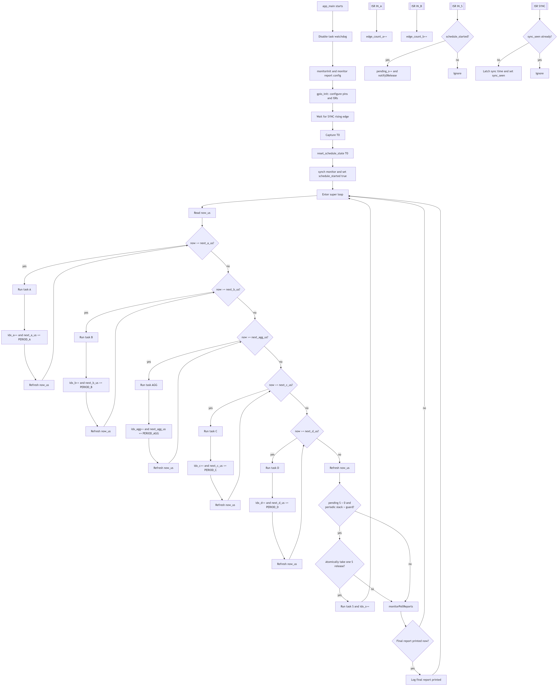

# Embedded FreeRTOS Project

## Overview

Implementing a FreeRTOS super-loop scheduler on an ESP-32 using GPIO intterrupts, timed periodic releases and one sporadic task. Code task is defined as:
1. Wait for hardware SYNC to define time zero
2. Run period tasks A,B,AGG,C,D at fixed periods
3. Accept sporadic release S from an interrupt - only run when there is enough timing slack 
4. Toggle ACK GPIOs and call monitor hooks around each task for timing/reporting
5. Exectute workload via WorkKernel with per-task cycle budgets.

### Procedural floW

## GPIO 

Inputs and outputs - including monitoring and expected behaviour 

| Function | Pin Name | GPIO | Type | Connected To | Purpose |
| --- | --- | --- | --- | --- | --- |
| SYNC | PIN_SYNC | 13 | Input | Output 1 (Pulse) | Global time reference T0 (rising edge). |
| Input A | PIN_IN_A | 14 | Input | Output 2 (Square Wave) | Rising edges for Task A computations. |
| Input B | PIN_IN_B | 25 | Input | Output 3 (Square Wave) | Rising edges for Task B computations. |
| Sporadic Trigger | PIN_IN_S | 26 | Input | Output 4 (Pulse) | Triggers sporadic Task S. |
| Mode Control | PIN_IN_MODE | 27 | Input | Output 5 (Steady HIGH/LOW) | Enables/disables tasks C and D (for FreeRTOS, not super-loop). |
| ACK Task A | ACK_A | 16 | Output | Probe 1 | Goes HIGH during Task A execution. |
| ACK Task B | ACK_B | 17 | Output | Probe 2 | Goes HIGH during Task B execution. |
| ACK Task AGG | ACK_AGG | 18 | Output | Probe 3 | Goes HIGH during Task AGG execution. |
| ACK Task C | ACK_C | 19 | Output | Probe 4 | Goes HIGH during Task C execution. |
| ACK Task D | ACK_D | 21 | Output | Probe 5 | Goes HIGH during Task D execution. |
| ACK Sporadic | ACK_S | 22 | Output | Probe 6 | Goes HIGH during Task S execution. |
